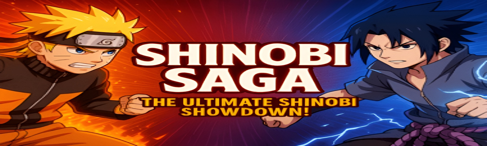
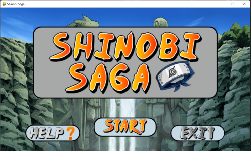
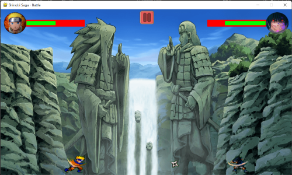
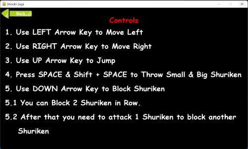
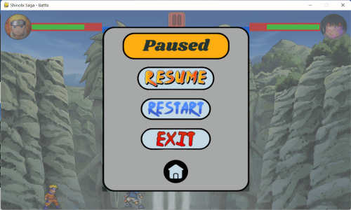
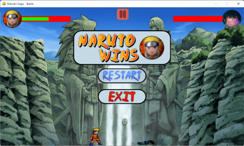

# 🌀 Shinobi Saga - Naruto vs Sasuke ⚔️



**Shinobi Saga** is a fast-paced 2D fighting game built with **Python** and **Pygame**, featuring anime-inspired characters — **Naruto** and **Sasuke** — locked in an epic shinobi showdown. Enjoy smooth combat, animated attacks, health bars, and immersive sound effects in this first version of the game.


---

## 📚 Table of Contents

- [Game Features](#-game-features)
- [Screenshots](#-screenshots)
- [Tech Stack](#-tech-stack)
- [Project Structure](#-project-structure)
- [Setup & Installation](#-setup--installation)
- [Build Executable](#-build-executable-windows)
- [Future Plans](#-future-plans)
- [License](#-license)
- [Disclaimer](#-disclaimer)
- [Show Your Support](#-show-your-support)
- [Contributing](#-contributing)
- [External Resources](#-external-resources)
- [Developer](#-developer)

---

## 🎮 Game Features

- 🧍‍♂️ **Playable Characters**: Naruto (Player) vs Sasuke (Enemy)
- 🎞️ **Smooth Animations**: Idle, Run, Jump, Attack, Damage, Defeated, Victory
- 🛡️ **Block System**: Player can block attacks (up to 2 consecutive blocks)
- 🗡️ **Shuriken Combat**: Throwing projectiles with effects
- 💥 **Damage System**: Small and big shuriken cause different damage animations
- ⚰️ **Defeat Animation**: Unique falling + stepping back + ground-sink animation
- 🧠 **Smart AI**: Sasuke blocks automatically after hit and resets on next throw
- ❤️ **Health Bars** with Character Head Icons
- 🎵 **Sound Effects**: Click, Hit, Jump, Block, Background Music
- ⏸️ **Pause Menu**: Resume, Restart, Exit, Home Navigation
- 🏆 **Victory Banners**: Naruto Wins / Sasuke Wins
- 🧩 **Modular Codebase**: Easy to extend and manage
- 🖱️ **Interactive Buttons**: With click and hover effects
- 🎨 **Custom UI**: Game logo, UI icons, pause overlay, and more

---

## 📸 Screenshots

### 🏠 Main Menu


### ⚔️ Battle Scene


### ❓ Help Screen


### ⏸️ Pause Screen


### 💀 Naruto Win Screen


### 💀 Sasuke win Screen


---

## 🧠 Tech Stack

| Tool                | Purpose                        |
|-------------------- |-------------------------------|
| 🐍 Python & Pygame | Game logic and rendering       |
| 💻 VS Code         | Code editor                    |
| 🎨 Canva           | UI elements, icons             |
| 🔁 Git + GitHub    | Version control and hosting    |

---

## 📂 Project Structure

    ShinobiSaga/
    ├── assets/
    │ ├── images/
    │ │ ├── background/ → Game backgrounds
    │ │ ├── ui/ → UI elements (buttons, banners, icons)
    │ │ ├── weapons/ → Shuriken sprites
    │ │ └── characters/ → Naruto & Sasuke animations
    │ ├── sounds/ → Game sound effects & music
    │ └── Icon.ico → Game Icon for Executable file
    │  
    ├── src/
    │ ├── main.py → Game entry point
    │ ├── battle.py → Handles combat logic
    │ ├── player.py → Naruto logic & controls
    │ ├── enemy.py → Sasuke AI behavior
    │ ├── help.py → Help screen display
    │ ├── health.py → Health bar logic
    │ ├── button.py → Custom button UI
    │ ├── assets.py → Imports all the assets
    │ └── shuriken.py → Shuriken weapon logic
    │
    ├── README.md
    ├── requirements.txt
    ├── .gitignore
    └── LICENSE

---

## 💻 Setup & Installation

### ✅ Requirements

- Python 3.10+
- [Pygame](https://www.pygame.org/) (installed via pip)

### 📥 Installation

#### 1. Clone the repository
```bash
git clone https://github.com/Harsh-Belekar/Shinobi-Saga.git
cd Shinobi-Saga
```

#### 2. Create and activate a virtual environment (Optional but recommended)
```bash
python -m venv venv
venv\Scripts\activate   # On Windows
```

#### 3. Install dependencies
```bash
pip install -r requirements.txt
```

#### 4. Run the game
```bash
cd src
python main.py
```

---

## 🧪 Build Executable (Windows)
You can generate a Windows `.exe` using [PyInstaller](https://pyinstaller.org/):


#### ✅ 1. Install PyInstaller
Make sure you're in your virtual environment (optional but recommended):

```bash
pip install pyinstaller
```
#### ✅ 2. Navigate to the src Folder
The main.py file is inside src/, so:

```bash
cd src
```
#### ✅ 3. Run PyInstaller Command

```bash
python -m PyInstaller --onefile --windowed --icon=../assets/Icon.ico --add-data "../assets;assets" --name Shinobi-Saga main.py
```

#### ✅ 4. After Build Completes...
PyInstaller creates these folders:

    dist/         --> Contains your final .exe
    build/        --> Temporary files (you can delete this later)
    ShinobiSaga.spec --> Build specification file

Your .exe will be located in:

    /src/dist/ShinobiSaga.exe

---

## 🚀 Future Plans

 - 🧑‍🎨 Character Selection Screen

 - 🔥 Special Attacks for Each Character

 - 🤖 Smarter Enemy AI

 - 🌍 Expandable Shinobi Roster

 - 🎯 Combo-based Battle Mechanics

---

## 📄 License

This project is licensed under the [MIT License](LICENSE).
This game is for **educational and non-commercial** use only.

---

## Disclaimer
This project is a fan-made tribute inspired by the Naruto anime and manga series. All intellectual property relating to Naruto belongs to its respective owners (Shueisha, TV Tokyo, Studio Pierrot, etc.). This game is developed for educational and non-commercial purposes only. No copyright infringement is intended.

---

## ⭐ Show Your Support

##### If you like the project, please give it a ⭐️ on GitHub and share with fellow fans and developers!

 - ⭐ Star the repo

 - 🐛 Report bugs or suggestions via Issues

 - 🤝 Contribute to the next version!

---

## 🤝 Contributing

Pull requests are welcome! For major changes, please open an issue first to discuss what you would like to change.  
Make sure to follow best practices and test your changes.

---

## 🔗 External Resources

- [PyInstaller Docs](https://pyinstaller.org/)
- [Pygame Docs](https://www.pygame.org/docs/)
- [Naruto Wiki](https://naruto.fandom.com/)

---

## 👨‍💻 Developer

### 🙌 Built with ❤️ by [Harsh Belekar](https://github.com/Harsh-Belekar)

---
